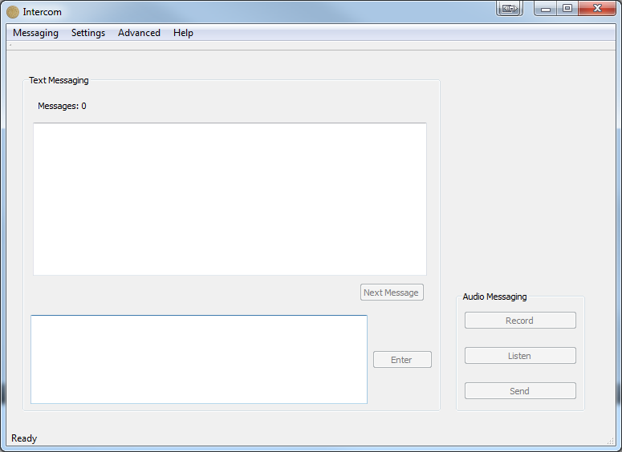
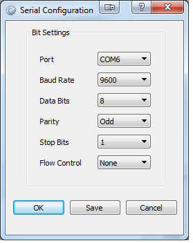
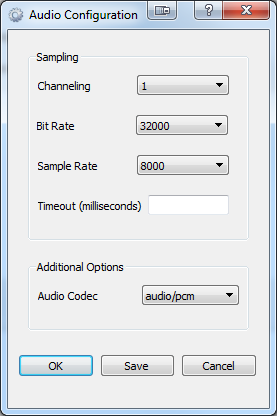
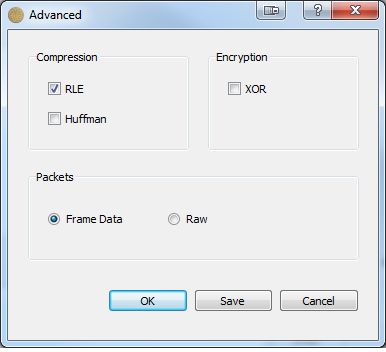

ESE Intercom
============
Intercom and Paging System  

Objective
---------

The goal of this project is to design and build a in house intercom and paging system that can 
communicate over house hold wiring. The Intercom will be able to send text messages to other station
 as well as audio messages.

Prerequisites
-------------

ESEIntercom uses QT as its user interface ( qt5 ).
Required Qt libraries must be placed in the executable directory or findable on the system path.

How to Use
----------

After starting the program you will see this window:

@image latex res/mainwindow.png

Here you have the option to send text or audio messages.

The Intercom audio and serial port configurations can all be set via seperate dialogs

Here is the Serial Settings Dialog:

@image latex res/serialsettings.png

Here is the Audio Settings Dialog:

@image latex res/audiosettings.png

And here is the Advanced Options Dialog:

@image latex res/advancedoptions.png